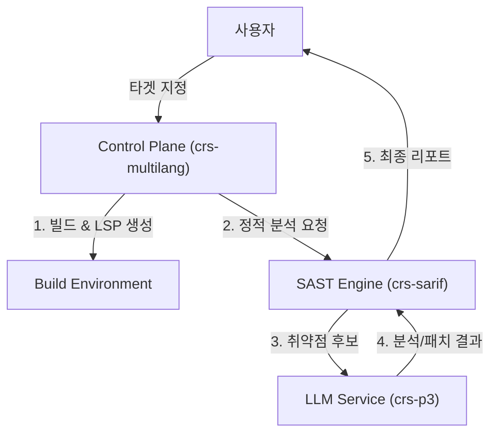

# AIxCC Atlantis (SAST + vLLM Edition)

이 프로젝트는 **AIxCC Atlantis**의 경량화 버전으로, 기존의 무거운 Fuzzing(퍼징) 엔진을 제거하고 **정적 분석(SAST)**과 **내부 LLM(vLLM)**을 활용한 취약점 분석 시스템으로 재구성되었습니다.

## 🎯 프로젝트 목표
*   **SAST 중심 분석**: Joern, CodeQL 등의 정적 분석 도구를 사용하여 코드의 잠재적 취약점을 식별합니다.
*   **LLM 기반 검증 및 패치**: 식별된 취약점 후보를 내부 vLLM 서비스(crs-p3)에 전달하여 정밀 분석하고 패치를 생성합니다.
*   **보안 및 효율성**: 외부 API 대신 자체 호스팅 LLM을 사용하여 데이터 보안을 강화하고 비용을 절감합니다.

## 🏗️ 아키텍처 (Architecture)



### 주요 컴포넌트
1.  **Control Plane (`cp_manager/bin/crs-multilang.py`)**: 전체 분석 워크플로우를 관리하고 타겟 프로젝트를 빌드합니다.
2.  **SAST Engine (`crs-sarif`)**: 소스 코드를 정적으로 분석하여 취약점 패턴을 탐지합니다 (Joern 등 활용).
3.  **LLM Service (`crs-p3`)**: vLLM 기반의 고성능 언어 모델 서빙 프레임워크로, 코드 이해 및 패치 생성을 담당합니다.

## 🚀 시작하기 (Getting Started)

### 사전 요구 사항 (Prerequisites)
*   Docker & Docker Compose
*   NVIDIA GPU (vLLM 구동용)
*   Python 3.10+

### 1. LLM 서비스 실행 (`crs-p3`)
먼저 내부 LLM 서비스를 실행해야 합니다.

```bash
cd crs-p3
./docker-build.sh
# GPU 사용 가능 시
docker run --gpus all -p 8000:8000 -p 8001:8001 crs-p3
```

### 2. SAST 분석 실행
타겟 프로젝트에 대해 분석을 수행합니다.

```bash
# Control Plane 디렉토리로 이동
cd cp_manager

# 분석 실행
python3 bin/crs-multilang.py run \
    --target <target_project_name> \
    --start-other-services
```

*   `--target`: 분석할 타겟 프로젝트의 이름 (OSS-Fuzz 프로젝트 기준)
*   `--start-other-services`: SAST 분석에 필요한 부가 서비스(Redis, Joern 등)를 함께 실행합니다.

## 📂 디렉토리 구조
*   `cp_manager/`: 분석 제어 및 오케스트레이션 로직
*   `crs-multilang/`: 타겟 빌드 및 환경 구성을 위한 Dockerfile 및 스크립트
*   `crs-sarif/`: 정적 분석(SAST) 엔진 및 SARIF 리포트 생성
*   `crs-p3/`: vLLM 기반 LLM 서빙 및 LoRA 학습 모듈
*   `crs-patch/`: (Optional) 패치 적용 및 검증 도구

## 📝 라이선스
[LICENSE 파일 참조]