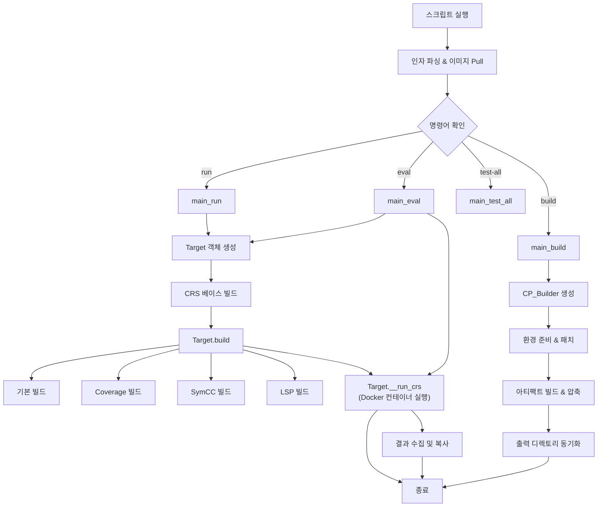
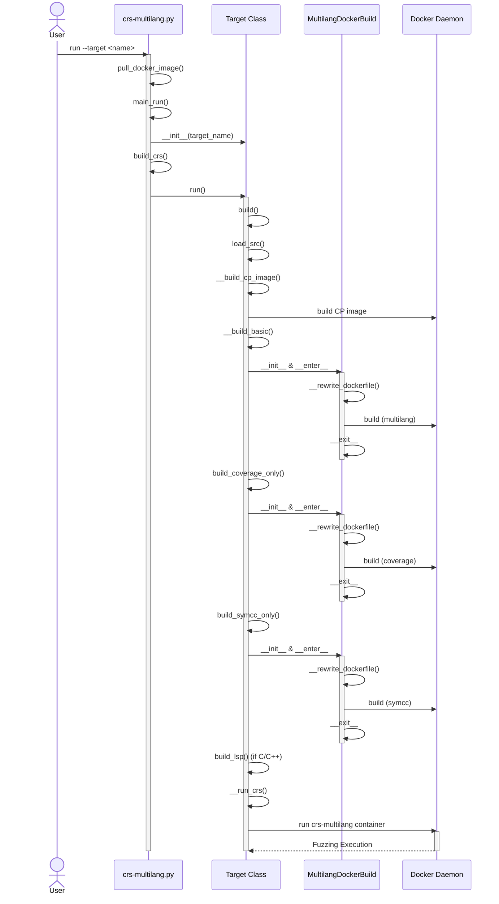

# CRS Multilang Flow Diagrams

## Execution Flowchart

### 플로우차트 설명 (Flowchart Description)
이 플로우차트는 `crs-multilang.py` 스크립트의 전체적인 실행 흐름을 보여줍니다.
1.  **초기화 (Initialization)**: 스크립트 실행 시 인자를 파싱하고 필요한 Docker 이미지를 준비합니다.
2.  **명령어 분기 (Command Dispatch)**: 사용자가 입력한 명령어(`run`, `eval`, `build`, `test-all`)에 따라 적절한 처리 함수로 분기합니다.
    *   **run**: 단일 타겟 프로젝트를 빌드하고 실행합니다.
    *   **eval**: 타겟 프로젝트를 실행하고 평가 결과를 수집합니다.
    *   **build**: 배포를 위한 CP 아티팩트를 빌드합니다.
    *   **test-all**: 모든 타겟에 대해 테스트를 병렬로 수행합니다.
3.  **타겟 처리 (Target Processing)**: `run`과 `eval` 명령은 `Target` 객체를 생성하여 프로젝트 설정을 관리합니다.
4.  **빌드 파이프라인 (Build Pipeline)**: `Target.build()`는 목적에 따라 여러 단계의 빌드(기본, Coverage, SymCC, LSP)를 순차적으로 수행합니다.
5.  **실행 (Execution)**: 모든 빌드가 완료되면 `Target.__run_crs()`가 `crs-multilang` Docker 컨테이너를 실행하여 퍼징을 시작합니다.

## Sequence Diagram (Run Command)

### 시퀀스 다이어그램 설명 (Sequence Diagram Description)
이 시퀀스 다이어그램은 `run` 명령어 실행 시 객체 간의 상호작용을 상세히 보여줍니다.
1.  **시작 (Setup)**: 사용자가 `run` 명령을 내리면 스크립트가 시작되고 이미지를 준비합니다.
2.  **타겟 초기화 (Target Initialization)**: `main_run` 함수에서 `Target` 클래스의 인스턴스를 생성하고 설정을 로드합니다.
3.  **빌드 프로세스 (Build Process)**: `Target.run()`이 `Target.build()`를 호출하며, 이는 다음 단계들을 포함합니다.
    *   `__build_cp_image()`: 기본 CP 이미지를 빌드합니다.
    *   `__build_basic()`: 퍼저와 타겟 바이너리를 빌드합니다.
    *   `build_coverage_only()`: 커버리지 측정을 위한 빌드를 수행합니다.
    *   `build_symcc_only()`: Concolic 실행을 위한 SymCC 계측 빌드를 수행합니다.
    *   `build_lsp()`: (C/C++의 경우) LSP 데이터를 생성합니다.
    *   **MultilangDockerBuild**: 각 빌드 단계마다 이 컨텍스트 매니저가 `Dockerfile`을 동적으로 수정하고 Docker 데몬에 빌드를 요청합니다.
4.  **실행 (Execution)**: 빌드가 완료되면 `Target.__run_crs()`가 Docker 컨테이너를 실행하여 실제 퍼징 작업을 수행합니다.

